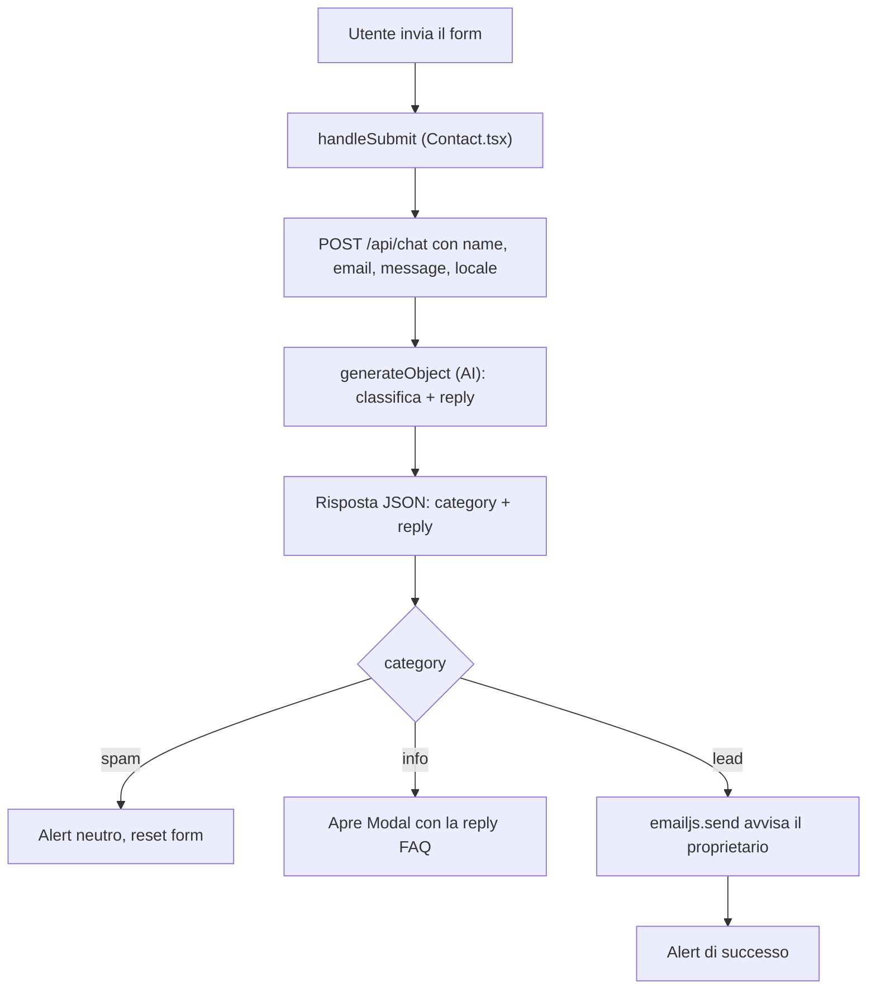

# Flusso agentico del form di contatto

> Branch: `ns/collegare-form-api-agent`
> Documento tecnico: cosa e' stato fatto, perche', e come migliorarlo.

## 1. Obiettivo

Trasformare il form di contatto del portfolio da un semplice "invia email" a un
**flusso agentico**: il messaggio dell'utente viene prima analizzato da un modello
AI, che lo classifica e decide cosa fare. Le tre categorie e le relative azioni sono:

| Categoria | Significato | Azione |
|-----------|-------------|--------|
| `spam` | pubblicita', testo senza senso, contenuti goliardici | Nessuna email. Messaggio neutro all'utente. |
| `info` | richiesta di informazioni rispondibile dalla FAQ | Apre un modale con la risposta generata dall'AI. |
| `lead` | potenziale cliente o proposta di collaborazione | Invia un'email di avviso al proprietario via EmailJS. |

## 2. Architettura e flusso dati

Punto chiave: **la classificazione avviene lato server** (route Next.js), mentre
**l'invio email resta lato client** (SDK browser di EmailJS, gia' configurato).
La risposta FAQ viene generata nello stesso giro della classificazione, per
evitare una seconda chiamata all'AI.

## 3. File creati e modificati

### Creati
- `src/lib/knowledge.ts` — knowledge base / FAQ e funzione `buildSystemPrompt(locale)`
  che costruisce il prompt di sistema (regole di classificazione + contenuti FAQ).
  I contenuti sono placeholder pensati per essere personalizzati.
- `src/components/Modal.tsx` — modale accessibile (chiusura con ESC, click sull'overlay,
  blocco dello scroll del body, focus automatico sul bottone) usato per mostrare la
  risposta alle richieste di informazioni.

### Modificati
- `src/app/api/chat/route.ts` — endpoint riscritto: da `streamText` a `generateObject`,
  con schema `zod` per ottenere un output strutturato `{ category, reply }`,
  validazione dell'input e gestione errori con `try/catch`.
- `src/hooks/useChat.ts` — da stub a hook `useContactAgent`, che incapsula la chiamata
  a `/api/chat` e gestisce `isLoading` ed `error`.
- `src/components/Contact.tsx` — `handleSubmit` ora e' asincrono: chiama l'agente,
  poi esegue uno `switch` sulla categoria (modale per `info`, EmailJS per `lead`,
  messaggio neutro per `spam`). Aggiunto il rendering del `Modal`.
- `src/store/i18n.ts` — nuove label localizzate (en/it/es/fr): titolo e bottone del
  modale, messaggio neutro per lo spam, messaggio di successo e messaggio di errore.
- `package.json` — aggiunta dipendenza `zod`.
- `.env` — variabili dei provider AI spostate lato server (vedi sezione Sicurezza).
  Nessun valore di chiave e' riportato in questo documento.

## 4. Decisioni tecniche (e perche')

- **Classificazione lato server.** Il prompt di sistema e la logica AI vivono nella
  route. Cosi' la knowledge base e le istruzioni non finiscono nel bundle del browser,
  e la chiave API resta segreta.
- **`generateObject` + schema `zod`.** Invece di far rispondere il modello in testo
  libero e poi fare il parsing, si forza un output strutturato e tipizzato
  (`category` come enum, `reply` come stringa). Piu' robusto e meno soggetto a errori.
- **Risposta FAQ nella stessa chiamata.** Riduce latenza e costi: una sola richiesta
  all'AI per classificare e (se serve) generare la risposta.
- **EmailJS lasciato sul client.** Era gia' integrato e funzionante; spostarlo lato
  server non dava vantaggi immediati. Viene invocato solo per i `lead`.
- **i18n centralizzato.** Tutti i messaggi mostrati all'utente passano dallo store i18n,
  coerentemente con il resto del sito (en/it/es/fr). La `reply` dell'AI viene generata
  nella lingua del `locale` corrente.
- **Modale dedicato e accessibile.** L'`Alert` esistente non era adatto a mostrare testi
  lunghi; il nuovo `Modal` gestisce overlay, tastiera e focus.

## 5. Sicurezza

- La chiave del provider AI e' usata **solo lato server**. In origine era esposta con
  prefisso `NEXT_PUBLIC_`, che l'avrebbe inclusa nel bundle JavaScript del browser
  (visibile a chiunque). E' stata spostata in una variabile server-side e va
  **rigenerata** se in passato e' stata pubblicata.
- Regola pratica: qualsiasi segreto (chiavi AI, token) non deve mai avere il prefisso
  `NEXT_PUBLIC_`. Solo i valori realmente pubblici (es. ID pubblici EmailJS) possono averlo.
- Le variabili `.env` vengono lette da Next.js **all'avvio**: dopo una modifica serve
  riavviare il dev server.

## 6. Provider AI: percorso e stato attuale

Durante l'integrazione sono stati incontrati limiti legati agli account dei provider
(non al codice):
- **Anthropic**: credito esaurito (errore `400`, credit balance too low).
- **Google Gemini**: prima quota gratuita a 0 sul progetto (errore `429`), poi modello
  `gemini-2.0-flash` non disponibile per i nuovi account (errore `404`).

Stato attuale: provider **Google Gemini**, modello **`gemini-2.5-flash`** (versione
attuale, veloce, adatta alla classificazione e inclusa nel piano gratuito). Il provider
legge la chiave dalla variabile d'ambiente server-side dedicata a Google.

## 7. Come testare

1. Inserire una chiave valida del provider nel file `.env` (lato server).
2. Avviare il sito: `npm run dev`.
3. Inviare il form con tre messaggi diversi:
   - "Che servizi offri?" -> dovrebbe aprirsi il modale con la risposta FAQ;
   - "Vorrei un preventivo per un e-commerce" -> dovrebbe partire l'email (EmailJS);
   - testo senza senso -> solo messaggio neutro, nessuna email.

## 8. Possibili miglioramenti

- **Rate limiting e anti-abuso.** Aggiungere un limite di richieste per IP e un honeypot
  o captcha per evitare che l'endpoint AI venga sfruttato da bot.
- **Validazione input piu' robusta.** Limitare la lunghezza del messaggio e validare
  formalmente l'email lato server (oltre alla validazione HTML del form).
- **Invio email lato server.** Spostare l'invio da EmailJS a un servizio server-side
  (es. Resend) per non dipendere da chiavi nel client e per loggare i lead in modo affidabile.
- **Persistenza dei lead.** Salvare i messaggi classificati in un database (es. Supabase)
  per avere uno storico e una dashboard, oltre alla sola email.
- **Fallback se l'AI non risponde.** Se la chiamata AI fallisce (quota, downtime),
  prevedere un fallback che invia comunque l'email anziche' mostrare solo un errore,
  per non perdere contatti potenzialmente importanti.
- **Gestione del rischio "spam".** Oggi un falso positivo (un vero cliente classificato
  come spam) viene scartato silenziosamente. Si potrebbe loggare comunque i messaggi
  "spam" per revisione manuale.
- **Streaming della risposta FAQ.** Per messaggi lunghi, mostrare la risposta in
  streaming nel modale migliorerebbe la percezione di velocita'.
- **Test automatici.** Aggiungere test sulla route (mock del provider AI) per coprire
  i tre rami di classificazione.
- **Knowledge base esterna.** Spostare i contenuti FAQ in un file dati o CMS, cosi' da
  aggiornarli senza toccare il codice.
